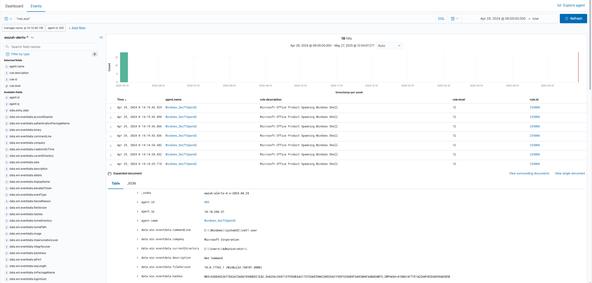
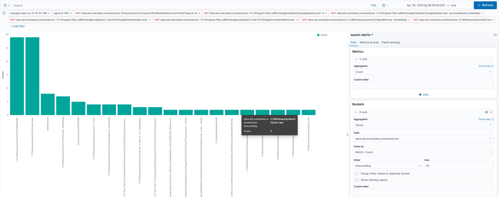
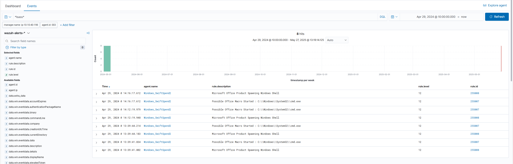
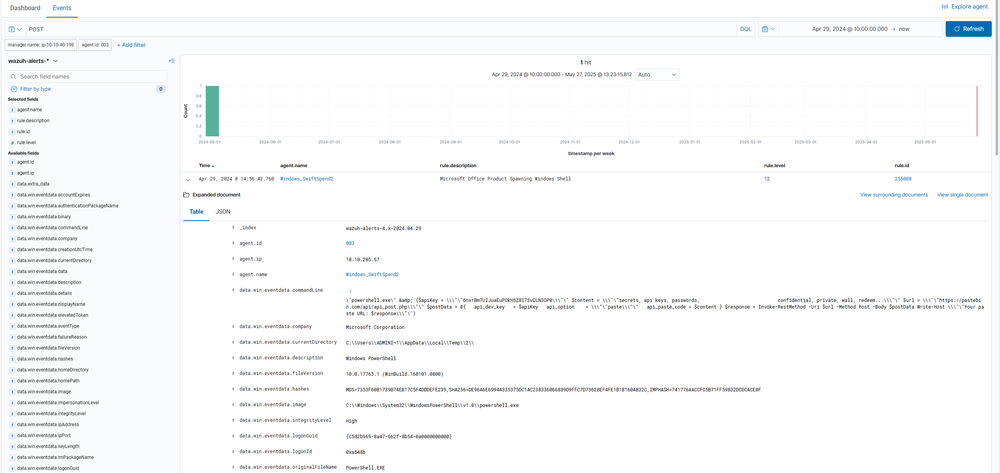

[🔙Take me back!🔙](../)

# Monday Monitor
Swiftspend Finance, the coolest fintech company in town, is on a mission to level up its cyber security game to keep those digital adversaries at bay and ensure their customers stay safe and sound.  
Led by the tech-savvy Senior Security Engineer John Sterling, Swiftspend's latest project is about beefing up their endpoint monitoring using Wazuh and Sysmon. They've been running some tests to see how well their cyber guardians can sniff out trouble. And guess what? You're the cyber sleuth they've called in to crack the code!  
The tests were run on Apr 29, 2024, between 12:00:00 and 20:00:00. As you dive into the logs, you'll look for any suspicious process shenanigans or weird network connections, you name it! Your mission? Unravel the mysteries within the logs and dish out some epic insights to fine-tune Swiftspend's defences.  

You can find the room [here](https://tryhackme.com/room/mondaymonitor).

## Table of Contents
<div id="toc" class="toc-container"></div>

## Getting Started
To start this challenge we need to start the attached VM to the host. It is not necessary to start an attack bock, since the host is directly available through the browser navigation to https://[MACHINE-IP].p.thmlabs.com.  
Once the machine is started, login using the given credentials:
```
username: admin
password: Mond*yM0nit0r7
```
Inside wazuh, it is important to select the proper query, because otherwise you will have a hard time finding the logs.  
From the wazuh landing page head to "Security events" and select the query on the left-hand side.


We know that the compromise happened between 29.04.2024 12:00 and 29.04.2024 20:00, so let's adjust the time range on the right side.  
Once we did that, we should get a bunch of events visible in the dashboard and should be ready to go to tackle the challenge.


## Question 1
**Initial access was established using a downloaded file. What is the file name saved on the host?**  
Looking at the first question, we need to find out how the malicious file was downloaded to get to know its name. A very common way of downloading files as an attacker is by using PowerShell and using a cmdlet like "certutil" or "Invoke-WebRequest". When searching for the latter we get a few hits and can also find the answer to our first question by observing the logs.


We note down the time of compromise (29.04.24 13:45:31.277) and also the name of the file to our list of IOCs.

## Question 2
**What is the full command run to create a scheduled task?**  
After answering question 1 we assume that this was the initial compromise of the system and that all the other things happened afterwards. So when searching for the next answers we keep in mind the initial time of compromise to build a logic timeline of the attack.  
Now we are searching for a potential malicious scheduled task creation. Usually this kind of action is done using the Windows onboard executable "schtasks.exe". When searching for it, we get a few hits. The fact that some of them seem to be connected to an Office Macro should already ring all your bells (remember question 1).  
When examining the first result we find the answer to our question.


## Question 3
**What time is the scheduled task meant to run?**  
While answering question 2 we should also be able to dissect the whole command and immediately answer question 3.

## Question 4
**What was encoded?**  
This question can also be answered with the content from question 2. However we need to do some additional steps.  
Once we found the encoded value, we head to [CyberChef](https://gchq.github.io/CyberChef/) and paste the encoded value into the "Input" field. As a recipe we choose "From Base64" and we should get our answer.

## Question 5
**What password was set for the new user account?**  
It took me quite a bit of time to figure this one out to be honest.  
I was way too focused on PowerShell and forgot basic windows tools that can be used to modify user accounts and groups.  
Unfortunately the existing wazuh rules did not help me either.  
So, what did I check for?  
Probably the first thing I looked for was any kind of PowerShell call that might be related to user creation:
```
New-LocalUser
password
passwords
pass
```
unfortunately, none of them led to any useful results.  
After that I searched for "-EncodedCommand" hoping I might find other Base64 encoded PowerShell commands that are creating a user. But that led to a dead end also.  

At this point I did a lot of manual digging and searching. I tried various search queries and scrolled a lot just through the logs and tried to understand what has been done by the adversary.  
This is actually a quite useful lesson since in real-life you might not always know what you're searching for and it takes time and patience to build a complete representation of the attack-chain. So you need to be ready to spend some time just manually digging and searching through the logs if you don't know how to proceed further.  
For the sake of reaching an answer of this room we'll look into some queries that will help you to find the answer to this question.

```
net command

net.exe

"/add"
```
Each of those three queries should return only a very limited set events that lead you to the answer of question 5.  
By examining those events you can also recognize why my previous queries didn't work. The adversary used the "net user" command and the password is simply passed as a commandline argument without a flag. Therefore searching for something like "password" would not lead to the answer.  



Another approach that helped me in a similar situation was to look at the overall commands issued by the adversary. Sorting it by the amount of calls and filtering-out some things that are not interesting could also lead to a trace to look for the "net user" command.


## Question 6
**What is the name of the .exe that was used to dump credentials?**  
Due to the fact that I have been observing quite a few logs in the previous five questions I accidentally stumbled upon this answer.  
The first instinct however should be to look for "mimikatz.exe" since it's the most common tool that is being used to dump any kind of credentials.  
When searching for it, we do see some action, but there never was any "dumping".  
If you're lucky you searched just for
```
mimikatz
```
and stumbled accidentally over the answer as well.  
The correct approach should be though to search for 
```
*lsass*
```
since it usually holds the hashes of recently logged in users and is accessed by Mimikatz to dump them.  
This way you should find the answer.


## Question 7
**Data was exfiltrated from the host. What was the flag that was part of the data?**  
The last question can be approached through different ways as well.  
Considering the fact that the adversary has been doing everything through PowerShell we could search for any kind of "POST" event that has been triggered using PowerShell. This way we actually find the answer immediately.
```
POST
```
In a fully equipped IT-(Security-)Infrastructure you should be able to search for potential malicious file-uploads. Domains like "pastebin[.com]" should trigger some alerts in most environments.  


## Summary

The “Monday Monitor” exercise gave us a great chance to practice our incident response and analysis skills in a realistic environment.  With Wazuh logging everything under the hood, we got a front-row seat to a full-blown endpoint compromise, from initial access to data exfiltration.  
The journey kicked off with a PowerShell download using `Invoke-WebRequest`, revealing our first clue: a suspiciously named file dropped on the host.  
From there, the adversary moved fast, creating a scheduled task via `schtasks.exe`, setting it to run at a specific time, and hiding their real intentions behind some Base64 encoding. CyberChef came in handy to decode that part.  

We hit a bit of a wall when it came to identifying the new user password.  
The lesson here?  
Not every attack screams “PowerShell.” Sometimes it’s just plain old `net user` with the password passed right in the command. There were no flags and no flair.  
The real-world takeaway: don’t get tunnel vision on just one toolset. Always zoom out and look at the bigger picture.

Later in the hunt, we spotted credential dumping activity, not with the usual `mimikatz.exe`, but with a process poking around `lsass`.  
A solid reminder to watch the behavior, not just the filename.  
And finally, with a simple search for `POST`, we uncovered the exfiltration attempt and the hidden flag that wrapped it all up.

All in all, this room was a solid training ground. Whether you’re just dipping your toes into threat hunting or already waist-deep in Blue Team ops, it drove home the importance of timelines, pivoting your search strategy, and not getting discouraged when things aren’t immediately obvious.  

As a side-note: I would've loved to see more "fancy" Wazuh functionalitites but maybe I simply used the tool wrong in some places.
