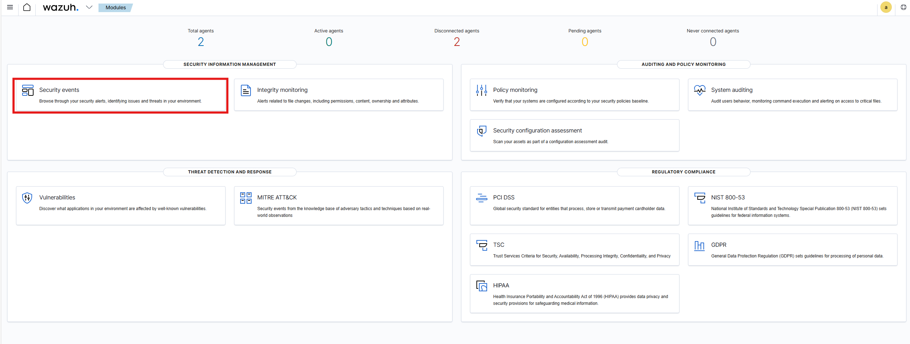
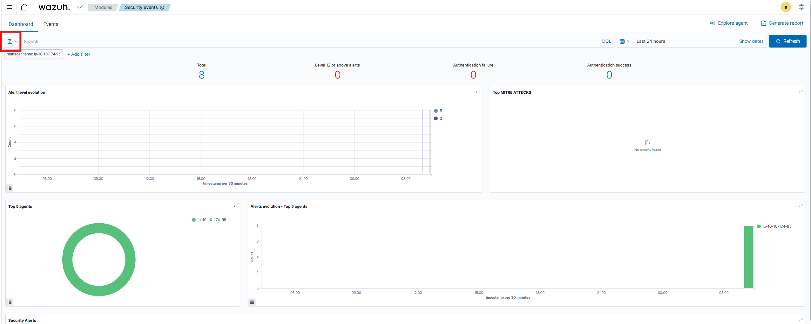
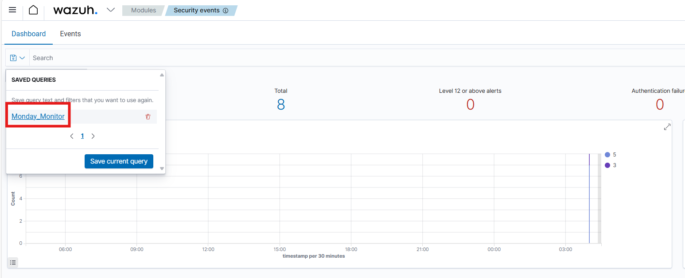
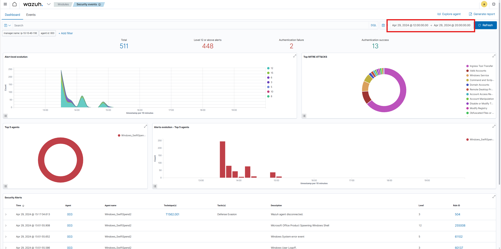
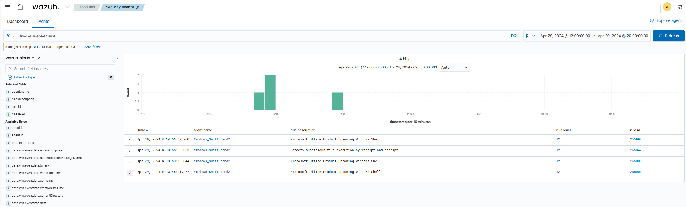
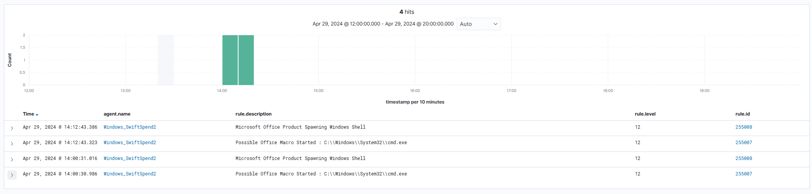

[🔙Take me back!🔙](../)

# Monday Monitor
Swiftspend Finance, the coolest fintech company in town, is on a mission to level up its cyber security game to keep those digital adversaries at bay and ensure their customers stay safe and sound.  
Led by the tech-savvy Senior Security Engineer John Sterling, Swiftspend's latest project is about beefing up their endpoint monitoring using Wazuh and Sysmon. They've been running some tests to see how well their cyber guardians can sniff out trouble. And guess what? You're the cyber sleuth they've called in to crack the code!  
The tests were run on Apr 29, 2024, between 12:00:00 and 20:00:00. As you dive into the logs, you'll look for any suspicious process shenanigans or weird network connections, you name it! Your mission? Unravel the mysteries within the logs and dish out some epic insights to fine-tune Swiftspend's defences.  

You can find the room [here](https://tryhackme.com/room/mondaymonitor).

## Table of Contents
<div id="toc" class="toc-container"></div>

## Getting Started
To start this challenge we need to start the attached VM to the host. It is not necessary to start an attack bock, since the host will be directly available through the browser navigation to https://[MACHINE-IP].p.thmlabs.com.  
Once the machine is started, login using the given credentials:
```
username: admin
password: Mond*yM0nit0r7
```
Inside wazuh, it is important to select the proper query because otherwise you will have a hard time finding the logs.  
From the wazuh landing page head to "Security events" and select the query on the left-hand side.




We know that the compromise happened between 29.04.2024 12:00 and 29.04.2024 20:00, so lets adjust the time range on the right side.  
Once we did that, we should get a bunch of events visible in the dashboard and should be ready to go to tackle the challenge.


## Question 1
**Initial access was established using a downloaded file. What is the file name saved on the host?**  
Looking at the first question, we need to find out how the malicious file was downloaded to get to know its name. A very common way of downloading files as an attacker is by using PowerShell and using a cmdlet like "certutil" or "Invoke-WebRequest". When searching for the latter we get a few hits and can also find the answer to our first question by observing the logs.



We note down the time of compromise (29.04.24 13:45:31.277) and also the name of the file to our list of IOCs.

## Question 2
**What is the full command run to create a scheduled task?**  
After answering question 1 we assume that this was the initial compromise of the system and that all the other things happened afterwards. So when searching for the next answers we keep in mind the initial time of compromise to build a logic timeline of the attack.  
Now we are searching for a potential malicious scheduled task creation. Usually this kind of action is done using the Windows onboard executable "schtasks.exe". When searching for it, we get a few hits. The fact that some of them seem to be connected to an Office Macro should already ring all your bells (remember question 1).  
When examining the first result we find the answer to our question.



## Question 3
**What time is the scheduled task meant to run?**  
While answering question 2 we should also be able to dissect the whole command and immediately answer question 3.

## Question 4
**What was encoded?**  
This question can also be answered with the content from question 2. However we need to do some addition steps.  
Once we found the encoded value, we head to [CyberChef](https://gchq.github.io/CyberChef/) and paste the encoded value into the "Input" field. As a recipe we chose "From Base64" and we should get our answer.

## Question 5
**What password was set for the new user account?**  


## Question 6
**What is the name of the .exe that was used to dump credentials?**  

## Question 7
**Data was exfiltrated from the host. What was the flag that was part of the data?**  
