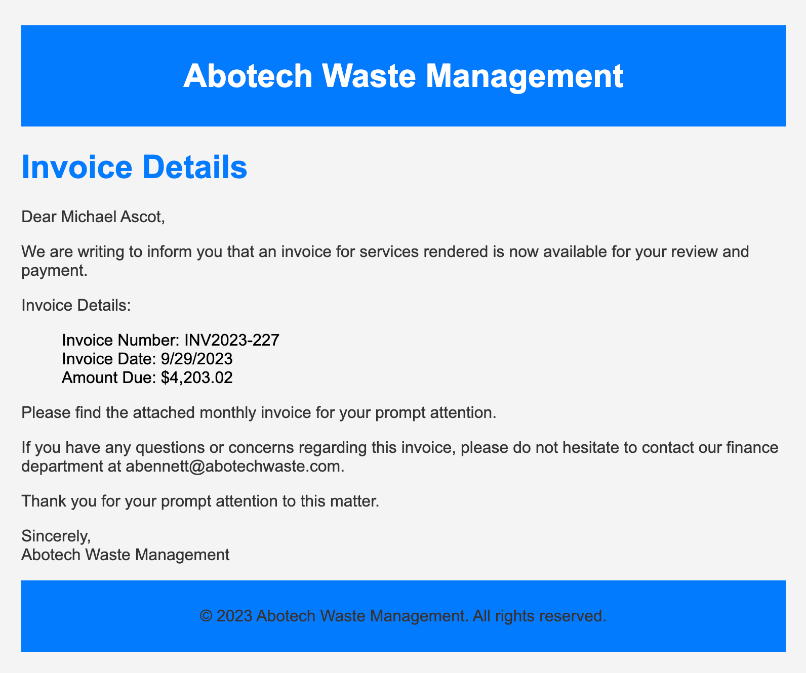

[🔙Take me back!🔙](../)

# Payment Collectors
On Friday, September 15, 2023, Michael Ascot, a Senior Finance Director from SwiftSpend, was checking his emails in Outlook and came across an email appearing to be from Abotech Waste Management regarding a monthly invoice for their services. Michael actioned this email and downloaded the attachment to his workstation without thinking.  

The following week, Michael received another email from his contact at Abotech claiming they were recently hacked and to carefully review any attachments sent by their employees. However, the damage has already been done. Use the attached Elastic instance to hunt for malicious activity on Michael's workstation and within the SwiftSpend domain!
## Table of Contents

## Getting Started
## Question 1
**What was the name of the ZIP attachment that Michael downloaded?**  

file.extension.keywords filter

## Question 2
**What was the contained file that Michael extracted from the attachment?**  

## Question 3
**What was the name of the command-line process that spawned from the extracted file attachment?**  

## Question 4
**What URL did the attacker use to download a tool to establish a reverse shell connection?**  

## Question 5
**What port did the workstation connect to the attacker on?**  

## Question 6
**What was the first native Windows binary the attacker ran for system enumeration after obtaining remote access?**  

## Question 7
**What is the URL of the script that the attacker downloads to enumerate the domain?**  

## Question 8
**What was the name of the file share that the attacker mapped to Michael's workstation?**  

## Question 9
**What directory did the attacker copy the contents of the file share to?**  

## Question 10
**What was the name of the Excel file the attacker extracted from the file share?**  

## Question 11
**What was the name of the archive file that the attacker created to prepare for exfiltration?**  

## Question 12
**What is the MITRE ID of the technique that the attacker used to exfiltrate the data?**

## Question 13
**What was the domain of the attacker's server that retrieved the exfiltrated data?**  

## Question 14
**The attacker exfiltrated an additional file from the victim's workstation. What is the flag you receive after reconstructing the file?**  

## END