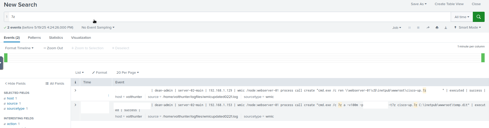

---
---
# Volt Typhoon
This write-up is for the "Volt Typhoon" room on TryHackMe. You can find the room here: https://tryhackme.com/room/volttyphoon.
This is my very first write-up for a THM room, so bear with me.
I hope it will help you solve this room while also learning and tackling these challenges.  
As a side note, I have little to no experience with Splunk. I mostly used very basic string searches that are connected with "AND," and they always led me to the result.

## Task 1 - IR Scenario
Task 1 does not ask you to do anything besides starting the attached machine and connecting to the Splunk instance hosted on it (http://MACHINE_IP:8000). I used the THM Attack Box to connect to Splunk; however, it can also be done via your own system and OpenVPN.  
There was no need for me to log in to Splunk, as I was apparently already logged in.

## Task 2 - Initial Access
Volt Typhoon often gains initial access to target networks by exploiting vulnerabilities in enterprise software. In recent incidents, Volt Typhoon has been observed leveraging vulnerabilities in Zoho ManageEngine ADSelfService Plus, a popular self-service password management solution used by organizations.

### Question 1
**Comb through the ADSelfService Plus logs to begin retracing the attacker’s steps. At what time (ISO 8601 format) was Dean's password changed and their account taken over by the attacker?**

To answer that question, I paid attention to the user mentioned ("Dean"). I was hoping that his username was somehow connected to the real one and could be found in the logs.
I simply queried the logs by searching for "dean".
Luckily, we got quite a few results (note: remember to first search through "All time" data!).  

While scrolling through the results, you can quickly learn two things:

1. The username is not "Dean"; it is "dean-admin".
2. There seems to be a specific log source for the "ADSelfService Plus" logs, which we can filter for.
With these two things in mind, we build a new query that looks something like this:  

```
username="dean-admin" service_name=ADSelfServicePlus
```

This query narrows down all events connected to our target user "Dean" and possible actions related to the "ADSelfService Plus" service. Scrolling through the results, we should quickly spot events that somehow relate to "Password Change" activities. So let's add that to our query and check out the result to answer the first question.

```
username="dean-admin" service_name=ADSelfServicePlus action_name="Password Change"
```

Now our list of results is very short, and our answer is easy to spot. There is only one successful "Password Change" event. This is our first answer.


### Question 2
**Shortly after Dean's account was compromised, the attacker created a new administrator account. What is the name of the new account that was created?**

Now that we know the time of compromise, we should write that down and add it to our time filter to focus on the events post-compromise.  
Once that is done, we will try to find an event that indicates a new user has been created. Since we previously found out that Volt Typhoon compromised an account, it's safe to say the compromised account "dean-admin" was probably issuing this command.  
So we start with a super simple and basic first query:
```
username="dean-admin" create
```
The good thing is that we do find our answer.  
The bad thing is that we need to dig for it.  
I did not come up with the idea to additionally add the "useraccount" filter to the query. If I had thought of it, it would have been much easier since only one result would show up.

```
username="dean-admin" create useraccount
```


## Task 3 - Execution
Volt Typhoon is known to exploit Windows Management Instrumentation Command-line (WMIC) for a range of execution techniques. They leverage WMIC for tasks such as gathering information and dumping valuable databases, allowing them to infiltrate and exploit target networks. By using "living off the land" binaries (LOLBins), they blend in with legitimate system activity, making detection more challenging.

### Question 3
**In an information gathering attempt, what command does the attacker run to find information about local drives on server01 & server02?**  
This is where I actually struggled for the first time with my basic searches. When I first used the following query:
```
username="dean-admin" wmic
```
I received 19 pages of results and knew I was a bit far from finding the answer. So let's check the question again. The adversary wants to find out about local drives on the systems "server01" and "server02". Let's try to add that to our query and see how it affects the results:  
```
username="dean-admin" wmic disk server01
```
"No results".  
Bummer.  
What if we remove the "disk" keyword, since I don't know how the event will actually look until I've seen it? Maybe it's not called "disk" but something else. From our previous 19 pages of results, we can confirm that there are definitely events with "server01" in the logs, so chances are good that this keyword is actually correct. So let's try:
```
username="dean-admin" wmic server01
```

And great success! We receive only one result, we can see why our previous query didn't work and we also have our answer.


### Question 4
**The attacker uses ntdsutil to create a copy of the AD database. After moving the file to a web server, the attacker compresses the database. What password does the attacker set on the archive?**  
To get to the answer to this question, we actually have to perform at least two queries. First of all, we learned that the attacker uses "ntdsutil" to create AD database copies. So let's try that first and check out the results.  

```
username="dean-admin" ntdsutil
```

We actually receive only one event, which tells us the name of the AD database copy file. With that knowledge, we create a new query that includes the previously found filename.

```
username="dean-admin" temp.dit
```

Using this query, we receive three matching events. We see the creation event (which we saw earlier) and two others. If we examine the two other events, we notice that one of them seems to copy the file to a public web server location on server01 using xcopy, and the other one performs a 7z operation on the file, including a password in the command-line arguments.  


## Task 4 - Persistence
Our target APT frequently employs web shells as a persistence mechanism to maintain a foothold. They disguise these web shells as legitimate files, enabling remote control over the server and allowing them to execute commands undetected.  
### Question 5
**To establish persistence on the compromised server, the attacker created a web shell using base64 encoded text. In which directory was the web shell placed?**  
For this question, there was probably a bit of luck involved. If you paid close attention to the previous query results, you could see that file operations usually happened in a specific directory. When using that directory (you can actually spot it with the last query I used to search for the temp.dit file), I tried it inside THM, and it was the answer.  
But how would one find out the answer to this question without "cheating"?  
Here I used some OSINT to lead me to the answer.  
I went to [MITRE ATT&CK](https://attack.mitre.org/) and searched for our APT that we are apparently dealing with. When searching through their techniques, I found out, that [Volt Typhoon](https://attack.mitre.org/groups/G1017/) apparently has two special names for their web shells (AuditReport.jspx and iisstart.aspx) so I used that as a hint and built a query based on that:
```
powershell AuditReport.jspx
```

From the results we learn three things:
1. The web shell we searched for (AuditReport.jspx), was definitely used, but named something else previously (iistart.aspx)
2. The web shell has been copied from location A to location B. Location A is actually our answer to the question
3. The web shell was spread to another system and probably used for lateral movement.
With that knowledge, we should search for the original filename to see where it came from (and how it got there).  
```
powershell iisstart.aspx
```

We see that the web shell got to its first destination by abusing certutil (which is also one of their techniques mentioned at MITRE ATT&CK).  

Was using MITRE ATT&CK less cheating than my previous answer? I guess. At least it was a cleaner and more reasonable way to get to the solution instead of "the cheat".

## Task 5 - Defense Evasion
Volt Typhoon utilizes advanced defense evasion techniques to significantly reduce the risk of detection. These methods encompass regular file purging, eliminating logs, and conducting thorough reconnaissance of their operational environment.

### Question 6
**In an attempt to begin covering their tracks, the attackers remove evidence of the compromise. They first start by wiping RDP records. What PowerShell cmdlet does the attacker use to remove the “Most Recently Used” record?**  
To answer this question, I had to perform some OSINT again. I did not know which PowerShell cmdlet would be able to remove the "Most Recently Used" (MRU) records, so I did a quick Google search. The results did not help much, but I found out that you could remove them through registry keys. So, I searched inside Splunk for the mentioned registry keys, hoping to find any kind of interaction with them.
```
powershell "*terminal server*"
```
With these results, I could see that there had indeed been interactions with the registry key responsible for storing the MRUs. However, this was not my answer yet, since it had only been stored in a variable, and I did not have the actual PowerShell call for removing them in my results.
So, I did another search for the PowerShell variable while keeping an eye on the timestamps to ensure they roughly matched my previous results.
```
powershell "*registryPath*"
```

We received nine results, and some of them appear to remove something. Those of you who are more familiar with PowerShell than I am will immediately recognize that this is the answer to our question.

### Question 7
**The APT continues to cover their tracks by renaming and changing the extension of the previously created archive. What is the file name (with extension) created by the attackers?**  
This question was rather simple compared to the previous ones. We remember from question 4 that the adversary used a 7z command to create the archive. We can search for that to find out the name of the created file again.
```
7z
```
We should receive two results. One of them is the creation command event that we already saw in question 4. The second one holds the answer, as it contains the renaming command for the file.


### Question 8
**Under what regedit path does the attacker check for evidence of a virtualized environment?**
Here, I did a quick Google search again to see which kind of virtualization would store which kind of key. I found out that most of them contain some form of "virtual" (who would have guessed that) in their key. So, I just searched for that and immediately got the answer.
```
virtual
```

## Task 6 - Credential Access
Volt Typhoon often combs through target networks to uncover and extract credentials from a range of programs. Additionally, they are known to access hashed credentials directly from system memory.

### Question 9
**Using reg query, Volt Typhoon hunts for opportunities to find useful credentials. What three pieces of software do they investigate?
Answer Format: Alphabetical order separated by a comma and space.**  
To get to this answer I also chose the "slow" way. I simply queried Splunk for any kind of "reg query" commands and reached the answer.
```
reg query
```

However, you could have also scrolled and read through all MITRE ATT&CK page and would have found the answer there as well.

### Question 10
**What is the full decoded command the attacker uses to download and run mimikatz?**  
This one drove me crazy, not gonna lie.
I eventually had to put it aside and do all the other questions first until I could answer this one, but at some point, I finally found it.
Searching through Splunk for "Mimikatz" was unsuccessful; also, searching for any kind of download event like Invoke-WebRequest, certutil, etc., was all unsuccessful. The reason: as written in the question, we are searching for an encoded command. So, I was kind of lost on how I could find this kind of event.  
I did some more online research and found that the PowerShell flag to run encoded commands would be -EncodedCommand, but no luck there either.  
Trying to search for events with a long entry in the "CommandLine" field did not show any useful results. I did some more filtering and wanted to know what kind of command I might have missed in my research so far. Maybe there was another way of executing encoded commands, and I simply could not find it.  
So, I built a statistical overview inside Splunk of all the commands that had been issued by the adversary using this query::
```
CommandLine="*"| top limit=150 CommandLine
```

Eight pages of results did not seem promising at all. However, I knew I was searching for the needle in the haystack, so I made a bold move and started from the back (so the least number of called commands) and there it was. Hidden in plain sight another way of calling PowerShell commands from one PowerShell instance to another, **bypassing** execution policies and **-E**ncoding the following command.


When clicking on the event I could see the full command, including the Base64 encoded part. I put this in [CyberChef](https://gchq.github.io/CyberChef/) and finally got the answer to this question.


## Task 7 - Discovery & Lateral Movement
Volt Typhoon uses enumeration techniques to gather additional information about network architecture, logging mechanisms, successful logins, and software configurations, enhancing their understanding of the target environment for strategic purposes.  
The APT has been observed moving previously created web shells to different servers as part of their lateral movement strategy. This technique facilitates their ability to traverse through networks and maintain access across multiple systems.

### Question 11
**The attacker uses wevtutil, a log retrieval tool, to enumerate Windows logs. What event IDs does the attacker search for?
Answer Format: Increasing order separated by a space.**  
Compared to the previous question, the following was basically a walk in the park :-)  
I simply searched for 
```
wevtutil
```
And examined the results. There were 12 results, but scrolling through them revealed the answer pretty quickly, which did not call for any further filtering.

### Question 12
**Moving laterally to server-02, the attacker copies over the original web shell. What is the name of the new web shell that was created?**  
If you paid close attention to question 5, you should already know this answer.

## Task 8 - Collection
During the collection phase, Volt Typhoon extracts various types of data, such as local web browser information and valuable assets discovered within the target environment.

### Question 13
**The attacker is able to locate some valuable financial information during the collection phase. What three files does Volt Typhoon make copies of using PowerShell?
Answer Format: Increasing order separated by a space.**  
This one was also quite easy to answer (perhaps too easy?).  
Searching for 
```
*finance*
```
revealed a few files in a very common comma-separated-value format which where the answer.

## Task 9 - C2 & Cleanup
Volt Typhoon utilizes publicly available tools as well as compromised devices to establish discreet command and control (C2) channels.  
To cover their tracks, the APT has been observed deleting event logs and selectively removing other traces and artifacts of their malicious activities.  

### Question 14
**The attacker uses netsh to create a proxy for C2 communications. What connect address and port does the attacker use when setting up the proxy?
Answer Format: IP Port**  
Now we need to find the netsh command that established the C2 channel. We search for it using 
```
netsh
```

and find the answer in one of the four results.

### Question 15
**To conceal their activities, what are the four types of event logs the attacker clears on the compromised system?**  
Last but not least: how do we find any PowerShell command that might have deleted any kind of Windows-EventLogs? We consult google and discover that wevtutil can also be used to **cl**ear events. We search for that, including the "clear" flag, and find our answer.

```
wevtutil cl
```


## END
I hope you enjoyed reading my write-up and that it helped you while you were struggling to find any of the answers.  
If you have any questions, don't hesitate to get in touch with me.
