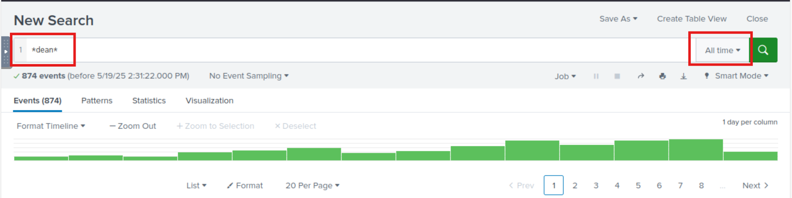
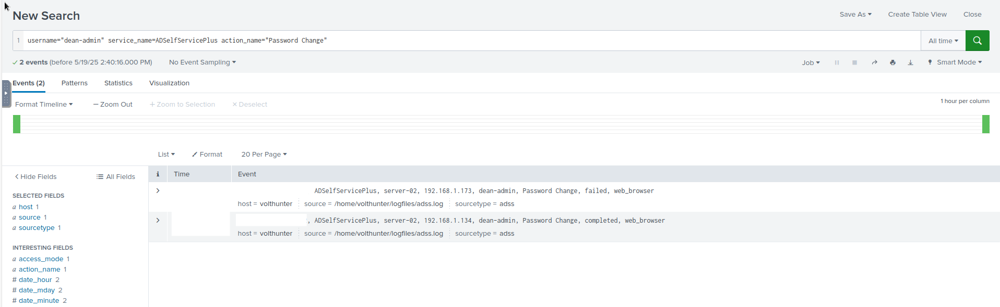
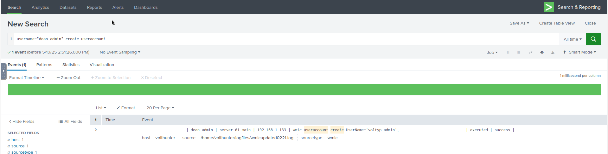
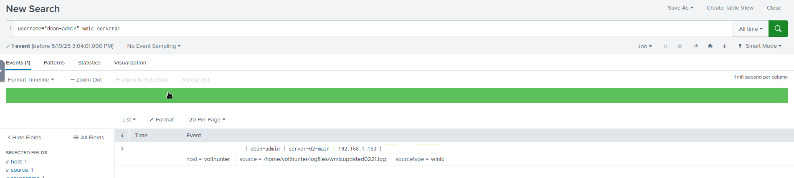
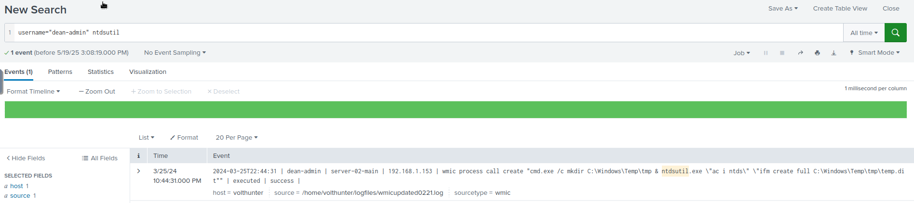
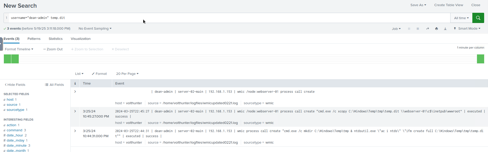
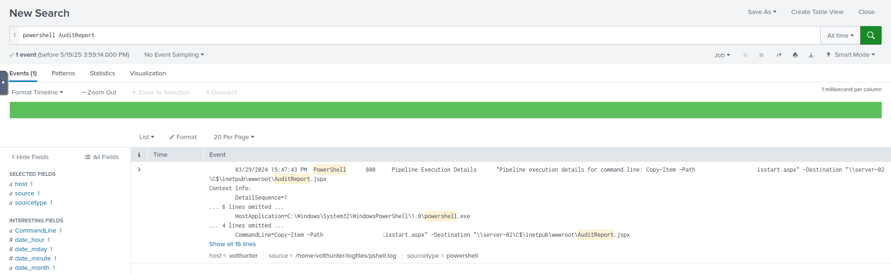
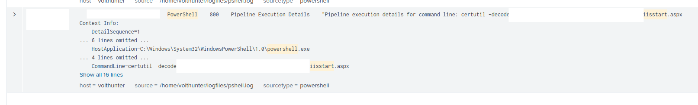
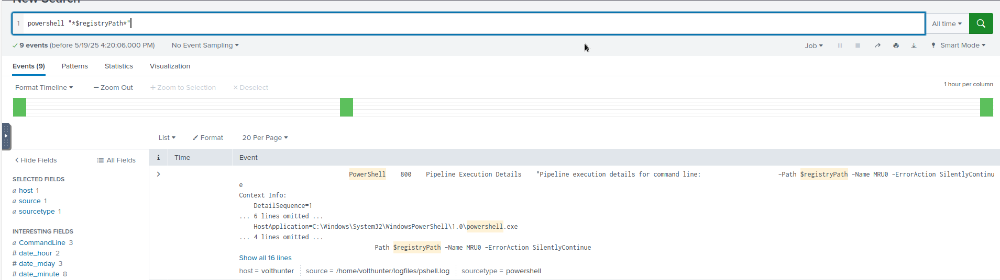
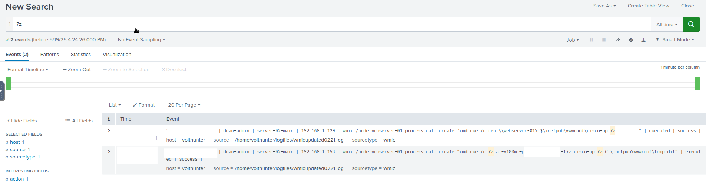

# Volt Typhoon
This Write-up is for the "Volt Typhoon" room of TryHackMe. You can find the room here: https://tryhackme.com/room/volttyphoon  
This is my very first own Write-Up for a THM room, so bear with me.  
I hope it will help you solving this room while also learning and tackling these challenges.  
As a side-note: I have zero to none experience with Splunk. I used mostly super basic string searches which are AND connected with each other and it lead me always to the result.

## Task 1 - IR Scenario
Task 1 does not ask you to do anything besides starting the attached machine and connecting to the Splunk instance that is hosted on it (http://MACHINE_IP:8000). I used the THM Attack-Box to connect to Splunk, however it can also be done via your own system and OpenVPN.  
There was no need for me to login to Splunk, I was already logged in apparently.

## Task 2 - Initial Access
Volt Typhoon often gains initial access to target networks by exploiting vulnerabilities in enterprise software. In recent incidents, Volt Typhoon has been observed leveraging vulnerabilities in Zoho ManageEngine ADSelfService Plus, a popular self-service password management solution used by organizations.

### Question 1
**Comb through the ADSelfService Plus logs to begin retracing the attacker’s steps. At what time (ISO 8601 format) was Dean's password changed and their account taken over by the attacker?**

To answer that question I paid attention to the user that was mentioned ("Dean"). I was hoping that his username was somehow connected to the real one and could be found in the logs.  
I simply queried the logs by searching for "dean".  
And luckily we got quite a few results (note: remember to first search through "All time" data!).

While scrolling through the results, you can quickly learn two thins:
1. the username is not "Dean" it is "dean-admin"
2. There seems to be a specific log source for the "ADSelfService Plus" logs which we can filter for.

With these two things in mind, we build a new query, looking something like this:
```
username="dean-admin" service_name=ADSelfServicePlus
```

This query narrows down all events connected to our target user "Dean" and possible actions connected to the "ADSelfService Plus" service. Scrolling through the results we should spot quickly events that somehow relate to "Password Change" activites. So lets add that to our query and check out the result to answer the first question.

```
username="dean-admin" service_name=ADSelfServicePlus action_name="Password Change"
```

Now our list of results is very short, and our answer easy to spot. There is only one successful "Password Change" event. This is our first answer.


### Question 2
**Shortly after Dean's account was compromised, the attacker created a new administrator account. What is the name of the new account that was created?**

Now that we know the time of compromise, we should write that down and add it to our time-filter to focus on the events post-compromise.
Once that is done, we will now try to find an event that tells us, that a new user has been created. And since we previously found out, that Volt Typhoon compromised an account, it's safe to say the compromised account "dean-admin" was probably issuing this command.  
So we start with a super simple and basic first query:
```
username="dean-admin" create
```
The good thing: we do find our answer.  
The bad thing: we need to dig for it.  
I did not come up with the idea to additionally add the "useraccount" filter to the query. If I would have though of it, it would have been way easier since only one result will show up.

```
username="dean-admin" create useraccount
```


## Task 3 - Execution
Volt Typhoon is known to exploit Windows Management Instrumentation Command-line (WMIC) for a range of execution techniques. They leverage WMIC for tasks such as gathering information and dumping valuable databases, allowing them to infiltrate and exploit target networks. By using "living off the land" binaries (LOLBins), they blend in with legitimate system activity, making detection more challenging.

### Question 3
**In an information gathering attempt, what command does the attacker run to find information about local drives on server01 & server02?**  
This is where I actually struggled for the first time with my basic searches. When I first used the following query:
```
username="dean-admin" wmic
```
I received 19 pages of results and knew I was a bit far off of finding the answer. So lets check the question again. The adversary wants to find out about local drives on the systems "server01" and "server02". Lets try to add that to our query and see how it affects the result:
```
username="dean-admin" wmic disk server01
```
"No results".  
Bummer.  
What if we remove the "disk" keyword, since I dont know how the event will actually look like until I've seen it, and maybe it's not called disk but something else. And from our previous 19 pages results we can confirm that there are definetely events with "server01" in the logs so chances are good that this keyword is actually right. So let's try:
```
username="dean-admin" wmic server01
```

And great success! We receive only one result, we can see why our previous query didn't work and we also have our answer.


### Question 4
**The attacker uses ntdsutil to create a copy of the AD database. After moving the file to a web server, the attacker compresses the database. What password does the attacker set on the archive?**  
To get to the answer of this question we actually have to perform at least two queries. First of all: we learned that the attacker uses "ntdsutil" to creat AD database copies. So let's try that first and check-out the results.

```
username="dean-admin" ntdsutil
```

We actually receive only one event, which tells us the name of the AD database copy file. With that knowledge, we create a new query, which includes the previous found-out filename.

```
username="dean-admin" temp.dit
```

Using this query, we receive three matching events. We see the creation event (which we saw earlier already) and two others. If we examine the two other events we notice that one of them seems to copy the file to a public webserver location on server01 using xcopy, and the other one does indeed perform a 7z operation on the file, including a password in the command-line-arguments.


## Task 4 - Persistence
Our target APT frequently employs web shells as a persistence mechanism to maintain a foothold. They disguise these web shells as legitimate files, enabling remote control over the server and allowing them to execute commands undetected.  
### Question 5
**To establish persistence on the compromised server, the attacker created a web shell using base64 encoded text. In which directory was the web shell placed?**  
For this question, there was probably a bit of luck involved. I you paid close attention to the previous query results you could see that file operations usually happened in a specific directory. When using that (you can acutally spot it with the last query I used to search for the temp.dit file). I tried it inside THM and it was the answer.  
But how would one find out the answer to this question without "cheating"?  
Here I used some OSINT to lead me to the answer.  
I went to [MITRE ATT&CK](https://attack.mitre.org/) and searched for our APT that we are apparently dealing with. When searching through their techniques I found out, that [Volt Typhoon](https://attack.mitre.org/groups/G1017/) apparently has two special names for their web shells (AuditReport.jspx and iisstart.aspx) so I used that as a hint and built a query based on that:
```
powershell AuditReport.jspx
```

From the results we learn three things:
1. The web shell we searched for (AuditReport.jspx), was definitely used, but named something else previously (iistart.aspx)
2. The web shell has been copied from location a to b. Location a is actually our answer to the question
3. The web shell was spread to another system and probably used for lateral movement.
With that knowledge, we should search for the original filename to see where it came from (and how it got there).  
```
powershell iisstart.aspx
```

We see that the web shell got to its first destination by abusing certutil (which is also on of their techniques mentioned at MITRE ATT&CK).  

Was using MITTRE ATT&CK less cheating than my previous answer? I guess. At least it was a cleaner and more reasonable way to get to the solution instead of "just trying".

## Task 5 - Defense Evasion
Volt Typhoon utilizes advanced defense evasion techniques to significantly reduce the risk of detection. These methods encompass regular file purging, eliminating logs, and conducting thorough reconnaissance of their operational environment.

### Question 6
**In an attempt to begin covering their tracks, the attackers remove evidence of the compromise. They first start by wiping RDP records. What PowerShell cmdlet does the attacker use to remove the “Most Recently Used” record?**  
To get to this question I had to perform some OSINT again. I did not know which PowerShell cmdlet would be able to remove the "Most recently used" (MRU) records, so I did a quick Google search. The results did not help a lot, but I found out, that you could remove that through registry keys. So I searched inside Splunk for the mentioned registry keys, hoping I would find any kind of interaction with them.
```
powershell "*terminal server*"
```
With these results I could see that there have been indeed interactions with the registry key responsible for storing the MRUs. However this was not my answer yet, since it had only been stored in a variable and I did not have the real PowerShell call for removing them in my results.  
So I did another search and search for the powershell variable and keeping an eye on the timestamps, so they would match roughly to my previous results
```
powershell "*registryPath*"
```

We get nine results and some of them do look like they remove something. And those of you who are more familiar with PowerShell than me know immediately that this is the answer to our question.

### Question 7
**The APT continues to cover their tracks by renaming and changing the extension of the previously created archive. What is the file name (with extension) created by the attackers?**  
This question was rather simply compared to the previous ones. We remember from question 4 that the adversary used a 7z command to create the archive. We can search for that to find out the name of the created file again.
```
7z
```
We should receive two results. One of them is the creation command event that we already saw in question 4. The second one holds the answer since it contains the renaming command of the file.


### Question 8
**Under what regedit path does the attacker check for evidence of a virtualized environment?**
Here I did a quick Google search again to see which kind of virtualization would store which kind of key. I found out, that most of them contain any kind of "virtual" (who would have guessed that) in theiry key. So I just search for that and immediately got the answer.
```
virtual
```

## Task 6 - Credential Access
## Task 7 - Discovery & Lateral Movement
## Task 8 - Collection
## Task 9 - C2 & Cleanup
